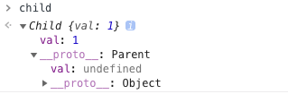
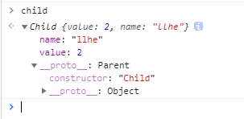

# var let const区别
## 提升
### 变量提升
```
console.log(a) // undefined
var a = 1
```
变量还没有被声明，但是我们却可以使用这个未被声明的变量，这种情况就叫做提升，并且提升的是声明。
### 函数提升
```
console.log(a) // ƒ a() {}
function a() {}
var a = 1
```
函数也会被提升，并且是优于变量提升的。
## 总结
* 函数提升优先于变量提升，函数提升会把整个函数挪到作用域顶部，变量提升只会把声明挪到作用域顶部
* var 存在提升，我们能在声明之前使用。let、const 因为暂时性死区的原因，不能在声明前使用
* var 在全局作用域下声明变量会导致变量挂载在 window 上，其他两者不会
* let 和 const 作用基本一致，但是后者声明的变量不能再次赋值
* var声明的变量，变量名可以重复声明
  
# 继承
* 组合继承是最常用的继承方式
  ```
  function Parent(value) {
    this.val = value
    }
    Parent.prototype.getValue = function() {
    console.log(this.val)
    }
    function Child(value) {
    Parent.call(this, value)
    }
    Child.prototype = new Parent()

    const child = new Child(1)
    ```


  以上继承的方式核心是在子类的构造函数中通过 Parent.call(this) 继承父类的属性，然后改变子类的原型为 new Parent() 来继承父类的函数。
这种继承方式优点在于构造函数可以传参，不会与父类引用属性共享，可以复用父类的函数，但是也存在一个缺点就是在继承父类函数的时候调用了父类构造函数，导致子类的原型上多了不需要的父类属性，存在内存上的浪费。
* 寄生组合继承
```
function Parent(value){
         this.value = value;
         this.name = 'llhe';
    }
    function Child(value){
        Parent.call(this,value)
    }
    Child.prototype = Object.create(Parent.prototype,{
        constructor:{
            value:'Child',
            writable:true,
            enumerable:false,
            configurable:true
        }
    })
    var child = new Child(2)
```
以上继承实现的核心就是将父类的原型赋值给了子类，并且将构造函数设置为子类，这样既解决了无用的父类属性问题，还能正确的找到子类的构造函数。



* class继承
```
class Parent {
  constructor(value) {
    this.val = value
  }
  getValue() {
    console.log(this.val)
  }
}
class Child extends Parent {
  constructor(value) {
    super(value)
    this.val = value
  }
}
```
class 实现继承的核心在于使用 extends 表明继承自哪个父类，并且在子类构造函数中必须调用 super，因为这段代码可以看成 Parent.call(this, value)。
# 模块化
## 为什么要使用模块化
* 解决命名冲突
* 提高复用性
* 提高代码可维护性

## 立即执行函数
在早期，使用立即执行函数实现模块化是常见的手段，通过函数作用域解决了命名冲突、污染全局作用域的问题
## CommonJS
CommonJS 最早是 Node 在使用，目前也仍然广泛使用，比如在 Webpack 中你就能见到它，当然目前在 Node 中的模块管理已经和 CommonJS 有一些区别了。
```
// a.js
module.exports = {
    a: 1
}
// or 
exports.a = 1

// b.js
var module = require('./a.js')
module.a // -> log 1
```
## ES Module
import expoort

# Proxy
```
let p = new Proxy(target, handler)
```
target 代表需要添加代理的对象，handler 用来自定义对象中的操作，比如可以用来自定义 set 或者 get 函数。

# map filter reduce
* map 作用是生成一个新数组，遍历原数组，将每个元素拿出来做一些变换然后放入到新的数组中。
```
[1,2,3].map(v=>v+1);//[2,3,4]
```
另外 map 的回调函数接受三个参数，分别是当前索引元素，索引，原数组
```
[1,2,3].map((value,index,arr)=>{
    console.log(value);
    console.log(index);
    console.log(arr);
    return value+1
});//[2,3,4]
```

* filter 的作用也是生成一个新数组，在遍历数组的时候将返回值为 true 的元素放入新数组，我们可以利用这个函数删除一些不需要的元素
```
let array = [1, 2, 4, 6]
let newArray = array.filter(item => item !== 6)
console.log(newArray) // [1, 2, 4]
```
和 map 一样，filter 的回调函数也接受三个参数，用处也相同。

* reduce() 方法对数组中的每个元素执行一个由您提供的reducer函数(升序执行)，将其结果汇总为单个返回值。
```
const array1 = [1, 2, 3, 4];
const reducer = (accumulator, currentValue) => accumulator + currentValue;

// 1 + 2 + 3 + 4
console.log(array1.reduce(reducer));
// expected output: 10

```